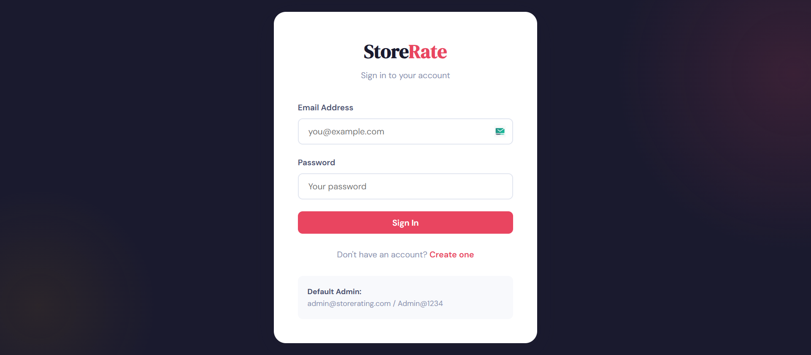
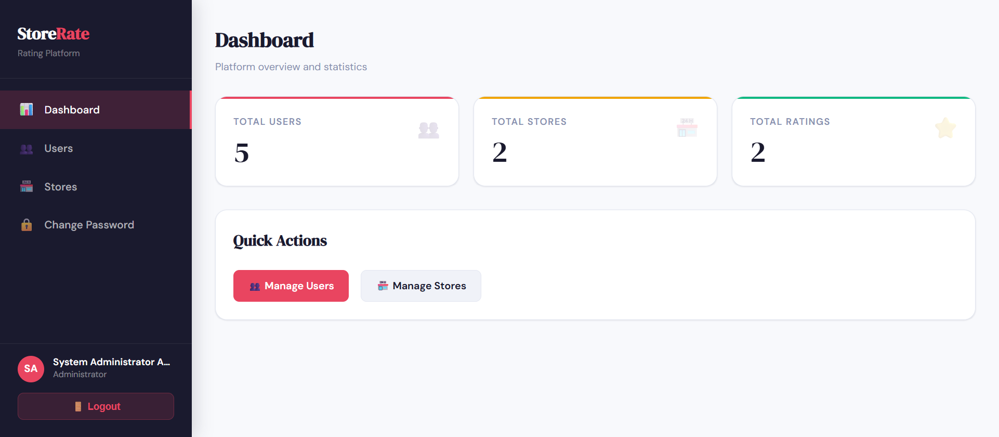
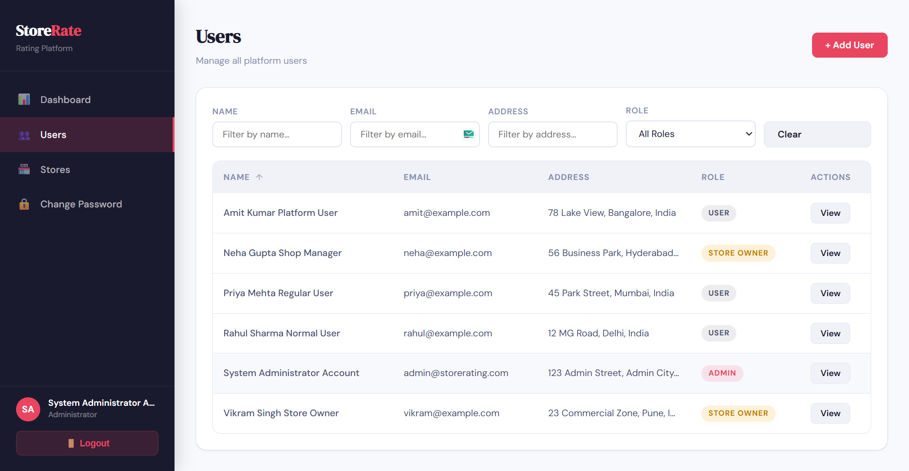
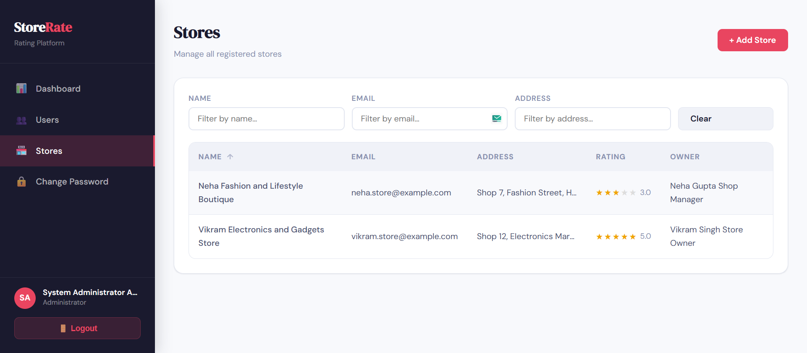
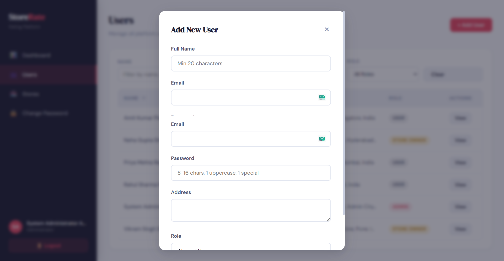
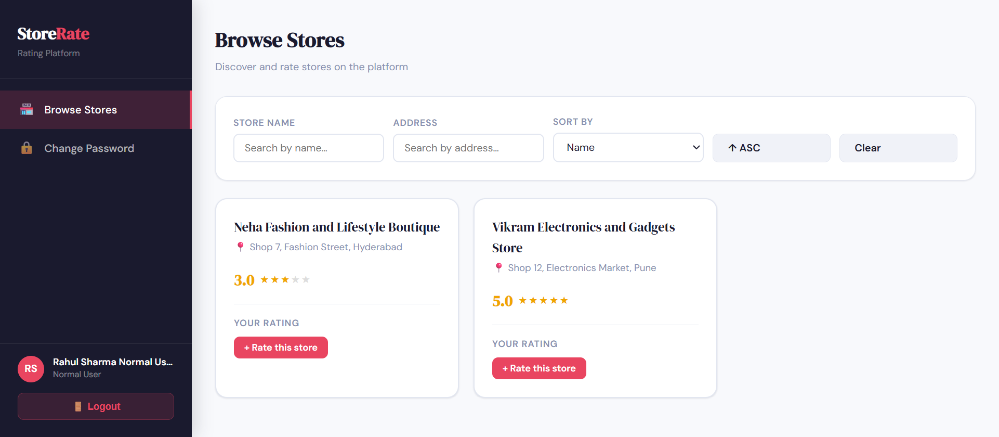
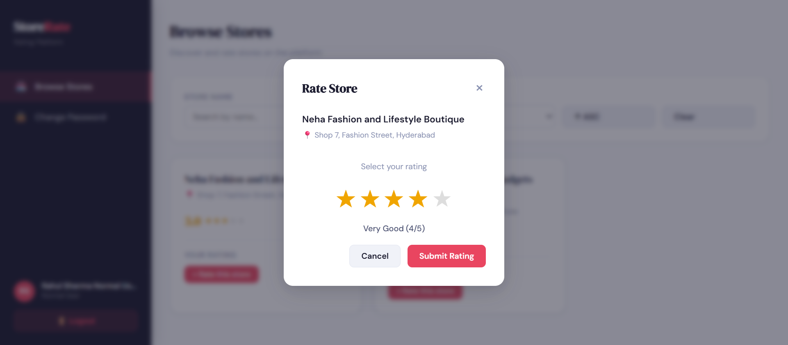
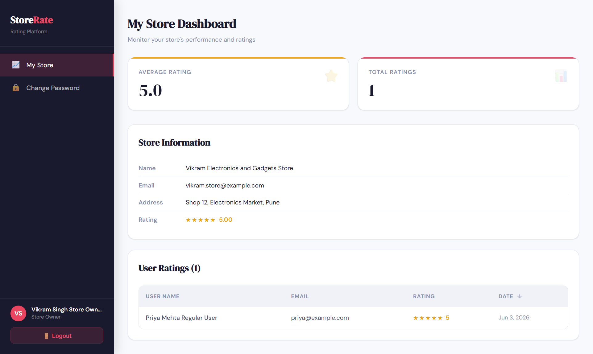

# StoreRate — Store Rating Platform

A full-stack web application where users can submit ratings for registered stores.

---

## 🛠️ Tech Stack

| Layer | Technology |
|-------|-----------|
| Frontend | React.js |
| Backend | Express.js (Node.js) |
| Database | PostgreSQL |
| Auth | JWT + bcrypt |

---

## 👤 User Roles

| Role | Description |
|------|-------------|
| **Admin** | Manages users & stores, views platform stats |
| **Normal User** | Browses stores, submits & modifies ratings |
| **Store Owner** | Views their store's ratings & average score |

---

## ✨ Features

### System Administrator
- Dashboard with total users, stores, and ratings count
- Add new users (admin, normal user, store owner)
- Add new stores and assign store owners
- View & filter users by Name, Email, Address, Role
- View & filter stores by Name, Email, Address
- Sortable tables (ascending/descending)
- View detailed user profiles

### Normal User
- Register & login
- Browse all registered stores
- Search stores by Name and Address
- Submit ratings (1–5 stars) for any store
- Modify previously submitted ratings
- Update password

### Store Owner
- Login to dashboard
- View list of users who rated their store
- See average rating of their store
- Update password

---

## 📋 Form Validations

| Field | Rule |
|-------|------|
| Name | 2–60 characters |
| Email | Standard email format |
| Password | 8–16 chars, at least 1 uppercase, 1 special character |
| Address | Max 400 characters |
| Rating | Integer between 1 and 5 |

---

## 🚀 Getting Started

### Prerequisites
- [Node.js](https://nodejs.org/) v16+
- [PostgreSQL](https://www.postgresql.org/) v13+
- [pgAdmin](https://www.pgadmin.org/) (recommended)

---

### 1. Clone the Repository

```bash
git clone https://github.com/aniket-dev30/Store-Rating-app.git
cd Store-Rating-app
```

---

### 2. Database Setup (pgAdmin)

1. Open **pgAdmin** and connect to your server
2. Right-click **Databases** → **Create** → **Database**
3. Name it: `store_rating_db` → click **Save**
4. Click on `store_rating_db` → open **Query Tool**
5. Click the folder icon → open `backend/src/config/schema.sql`
6. Press **F5** to execute

This creates all tables and seeds the default admin user.

---

### 3. Backend Setup

```bash
cd backend
npm install
cp .env.example .env
```

Edit `backend/.env`:

```env
PORT=5000
DB_HOST=localhost
DB_PORT=5432
DB_NAME=store_rating_db
DB_USER=postgres
DB_PASSWORD=your_postgres_password
JWT_SECRET=StoreRateSecret@123
JWT_EXPIRES_IN=7d
```

> If PostgreSQL has no password set, leave `DB_PASSWORD=` blank.

Start the backend:

```bash
npm run dev
```

Backend runs at: **http://localhost:5000**

---

### 4. Frontend Setup

```bash
cd frontend
npm install
cp .env.example .env
```

`frontend/.env` should contain:

```env
REACT_APP_API_URL=http://localhost:5000/api
```

Start the frontend:

```bash
npm start
```

Frontend runs at: **http://localhost:3000**

---

## 🔐 Default Admin Credentials

| Field | Value |
|-------|-------|
| Email | admin@storerating.com |
| Password | Admin@1234 |

> Please change the admin password after first login.

---
## 📸 Screenshots

### Login Page


### Admin Login


### Admin Dashboard - Users


### Admin Dashboard - Stores


### Add User


### Store Listing (Normal User)


### Submit Rating


### Store Owner Dashboard


## 📁 Project Structure

```
Store-Rating-app/
├── backend/
│   ├── src/
│   │   ├── config/
│   │   │   ├── database.js        # PostgreSQL connection
│   │   │   └── schema.sql         # Database schema & seed
│   │   ├── controllers/
│   │   │   ├── authController.js
│   │   │   ├── adminController.js
│   │   │   ├── storeController.js
│   │   │   └── ownerController.js
│   │   ├── middleware/
│   │   │   ├── auth.js            # JWT authentication
│   │   │   └── validate.js        # Input validation
│   │   ├── routes/
│   │   │   ├── auth.js
│   │   │   ├── admin.js
│   │   │   ├── stores.js
│   │   │   └── owner.js
│   │   └── index.js               # Express entry point
│   ├── .env.example
│   └── package.json
│
├── frontend/
│   ├── public/
│   │   └── index.html
│   ├── src/
│   │   ├── context/
│   │   │   └── AuthContext.js     # Auth state management
│   │   ├── pages/
│   │   │   ├── LoginPage.js
│   │   │   ├── RegisterPage.js
│   │   │   ├── ChangePassword.js
│   │   │   ├── admin/
│   │   │   │   ├── AdminDashboard.js
│   │   │   │   ├── AdminUsers.js
│   │   │   │   └── AdminStores.js
│   │   │   ├── user/
│   │   │   │   └── UserDashboard.js
│   │   │   └── owner/
│   │   │       └── OwnerDashboard.js
│   │   ├── components/
│   │   │   └── common/
│   │   │       └── Layout.js      # Sidebar layout
│   │   ├── utils/
│   │   │   └── api.js             # Axios instance
│   │   ├── App.js                 # Routes & role redirects
│   │   └── index.css              # Global styles
│   ├── .env.example
│   └── package.json
│
├── .gitignore
└── README.md
```

---

## 🛠️ API Endpoints

### Auth
| Method | Endpoint | Description |
|--------|----------|-------------|
| POST | `/api/auth/register` | Register new user |
| POST | `/api/auth/login` | Login |
| GET | `/api/auth/me` | Get current user |
| PATCH | `/api/auth/password` | Update password |

### Admin *(admin role required)*
| Method | Endpoint | Description |
|--------|----------|-------------|
| GET | `/api/admin/dashboard` | Platform stats |
| GET | `/api/admin/users` | List users (filterable/sortable) |
| GET | `/api/admin/users/:id` | User details |
| POST | `/api/admin/users` | Create user |
| GET | `/api/admin/stores` | List stores (filterable/sortable) |
| POST | `/api/admin/stores` | Create store |

### Stores *(user role required)*
| Method | Endpoint | Description |
|--------|----------|-------------|
| GET | `/api/stores` | List stores with user ratings |
| POST | `/api/stores/:id/ratings` | Submit or update rating |

### Store Owner *(store_owner role required)*
| Method | Endpoint | Description |
|--------|----------|-------------|
| GET | `/api/owner/dashboard` | Store dashboard & ratings |

---

## 🐛 Troubleshooting

**401 Unauthorized on login:**
- Run the schema SQL again to ensure the admin user exists
- Regenerate the password hash via: `node -e "const bcrypt = require('bcryptjs'); bcrypt.hash('Admin@1234', 10).then(h => console.log(h));"`
- Update it in the DB: `UPDATE users SET password = '<hash>' WHERE email = 'admin@storerating.com';`

**Cannot connect to database:**
- Ensure PostgreSQL is running
- Check `DB_NAME`, `DB_USER`, `DB_PASSWORD` in `backend/.env`
- If no password was set during PostgreSQL install, leave `DB_PASSWORD=` blank

**CORS errors:**
- Make sure backend is running on port 5000
- Verify `REACT_APP_API_URL=http://localhost:5000/api` in `frontend/.env`
